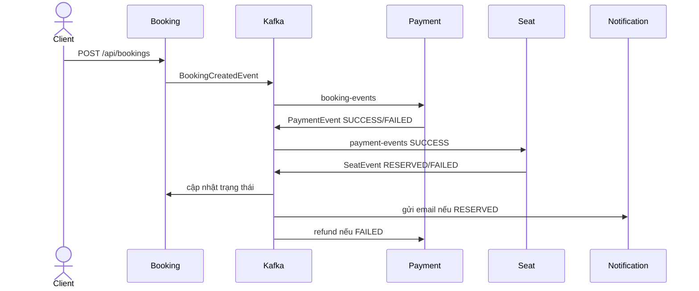

# SS15_HW03 - Choreography Saga đặt chỗ qua Kafka

**Sinh viên:** Trương Hà Cẩm Linh - **Mã sinh viên:** PTIT056

## 1. Mục tiêu

Dự án mô phỏng quy trình đặt chỗ bằng Choreography Saga. Các service chỉ trao đổi sự kiện qua Kafka, hoàn toàn không gọi HTTP trực tiếp lẫn nhau. HTTP chỉ được dùng ở cửa vào của `booking-service` để người dùng tạo yêu cầu.

## 2. Vai trò từng service

- `booking-service`: tạo booking trạng thái `PENDING`, phát `BookingCreatedEvent`, sau đó cập nhật `CONFIRMED` hoặc `CANCELLED` từ kết quả cuối.
- `payment-service`: nhận booking, mô phỏng thanh toán và phát `PaymentEvent`. Nếu Seat thất bại, service thực hiện hoàn tiền idempotent.
- `seat-service`: nhận thanh toán thành công, giữ ghế và phát `SeatEvent` với trạng thái `RESERVED` hoặc `FAILED`.
- `notification-service`: thuộc group riêng `notification-group`, nhận toàn bộ sự kiện giữ ghế thành công và mô phỏng gửi email.
- `common-events`: hợp đồng sự kiện dùng chung, giúp cấu trúc JSON nhất quán.

## 3. Luồng Choreography Saga



Luồng thành công: `PENDING -> PAYMENT SUCCESS -> SEAT RESERVED -> CONFIRMED`.

Luồng bù trừ: nếu giữ ghế thất bại sau khi đã thanh toán, `SeatEvent(FAILED)` được phát. Payment Service nhận sự kiện và hoàn tiền; Booking Service đồng thời chuyển booking sang `CANCELLED`.

## 4. Correlation ID

`booking-service` tạo một UUID cho mỗi Saga. Giá trị này nằm trong payload của mọi event và đồng thời được dùng làm Kafka record key. Payment và Seat giữ nguyên giá trị khi phát event tiếp theo. Vì vậy log của bốn service có thể lọc theo cùng một `correlationId`, còn các event của cùng Saga có xu hướng vào cùng partition để giữ thứ tự.

Ví dụ log mong đợi:

```text
[BookingService] correlationId=... - BookingCreated bookingId=BKG-...
[PaymentService] correlationId=... - payment status=SUCCESS
[SeatService] correlationId=... - seat A12 status=RESERVED
[NotifyService] Received confirmation for correlationId: ... - Sending email to camlinh@example.com
```

## 5. Cài đặt và chạy

Yêu cầu Java 17 và Docker.

```bash
docker compose up -d
./gradlew clean test
```

Mở bốn terminal và chạy:

```bash
./gradlew :booking-service:bootRun
./gradlew :payment-service:bootRun
./gradlew :seat-service:bootRun
./gradlew :notification-service:bootRun
```

Kafka tự tạo ba topic `booking-events`, `payment-events`, `seat-events` khi event đầu tiên được gửi. Có thể tạo thủ công nếu broker tắt auto-create.

## 6. Kiểm thử

```bash
chmod +x demo/test-booking.sh
./demo/test-booking.sh
```

- Ghế `A12`: toàn bộ luồng thành công, Notification ghi log gửi email.
- Ghế `X99`: Seat phát trạng thái thất bại, Payment hoàn tiền và Booking bị hủy.
- Số tiền lớn hơn `5.000.000`: Payment thất bại, Seat không xử lý và Booking bị hủy.

Để xem trạng thái cuối, lấy `bookingId` từ response rồi gọi:

```bash
curl http://localhost:8080/api/bookings/{bookingId}
```

## 7. Lưu ý triển khai thực tế

Bản demo lưu trạng thái trong RAM. Hệ thống thật cần database riêng, transactional outbox để tránh mất event, idempotency key lưu bền vững, retry/DLQ, schema registry và distributed tracing. Không nên chỉ dựa vào log hoặc bộ nhớ khi chạy nhiều instance.
